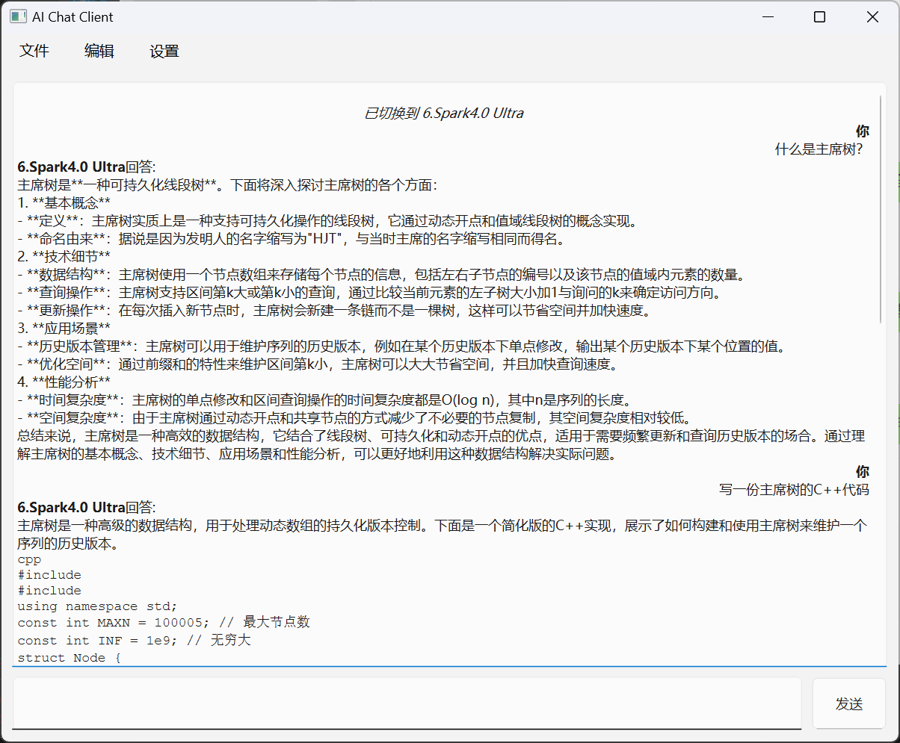

# 基于讯飞星火大模型的AI聊天客户端

## 📖 简介
基于讯飞星火大模型的AI聊天客户端，支持多种AI模型。

## 🎉 使用方法
1. 确保你已安装python环境，将项目解压到同一目录下。
2. 运行`pip install -r requirements.txt`安装依赖。
3. 在`sparkapi/config.py`中配置你的讯飞API信息。
4. 运行`python main.py`启动客户端。

## 📚 Demo
